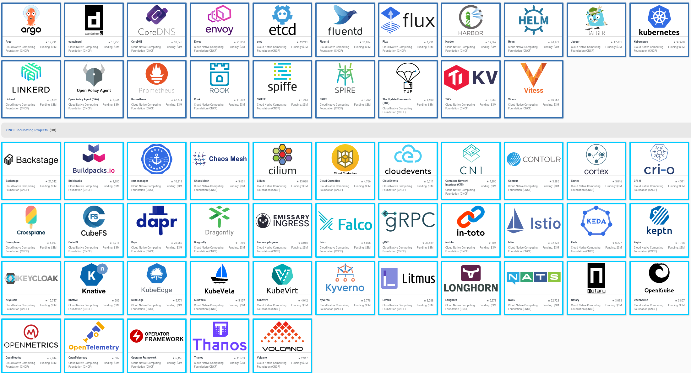

# Kubernetes Basics

An introduction to Kubernetes resources

----

## Agenda

<style scoped>
section {
  font-size: 21px;
}
</style>

- What is Kubernetes
- CNCF
- Pods
- Deployments
- Service
- Ingress
- cert-manager/external dns
- Cronjob
- ArgoCD
- External secrets
- Disk
- Best practices
  - Security
  - Antiaffinity
  - Priorityclasses
  - PDB
  - HPA

---

## What is Kubernetes?

- Container orchestration system
- Created by Google and RedHat with inspiration from Borg and Omega
- Part of CNCF

---

## CNCF



<!--
CNCF is a part of the Linux foundation
It’s umbrella organization to manage cloud native projects.

https://landscape.cncf.io/

They have 3 levels of projects

- Graduated
- Incubating
- Sandbox

This image is taken May 17 2023, it contains the graduated and the incubating projects that CNCF has.

Mostly what I do is to use these kind of third party applications to build a platform that you can use.

Some of these projects we use and some not.
-->

---

## Pods

<div class="grid grid-cols-2 gap-4">
<div>

- 1 or more containers
- shared filesystem between containers
- 1 ip per pod
- If a node goes down so does your pod

</div>
<div>

<font size="6">

```yaml
apiVersion: v1
kind: Pod
metadata:
  name: nginx
  namespace: default
  labels:
    app: nginx
spec:
  containers:
  - image: nginx:1.13.9
    name: nginx
    ports:
    - name: http
      containerPort: 80
```

</font>

</div>
</div>

---

## Deployment

<div class="grid grid-cols-2 gap-4">
<div>

- As a developer you create deployments
- Deployment you can manage Pods in a declarative and upgradable manner.

</div>
<div>

<font size="6">

```yaml
apiVersion: apps/v1
kind: Deployment
metadata:
  labels:
    app: nginx
  name: nginx
spec:
  replicas: 3
  selector:
    matchLabels:
      app: nginx
  template:
    metadata:
      labels:
        app: nginx
    spec:
      containers:
      - image: nginx:1.13.9-alpine
        name: nginx
        ports:
        - name: http
          containerPort: 80
```

</font>

</div>
</div>

<!--
- replicas
- matchLabels
- containerPort
-->

---

## Service

<div class="grid grid-cols-2 gap-4">
<div>
<font size="6">

- Expose one or multiple pods within the cluster
- Pod discovery and round robin LB (it’s stupid)
  - In general, don’t take zone or node in the consideration
- {service}.{namespace}.svc.cluster.local
- Service can expose multiple ports
- As developer, you should only use type: ClusterIP
</font>

</div>
<div>

<font size="6">

```yaml
apiVersion: v1
kind: Service
metadata:
  name: nginx
  namespace: default
  labels:
    app: nginx
spec:
  type: ClusterIP
  ports:
  - name: http
    port: 80
    targetPort: 80
  selector:
    app: nginx
```

</font>

</div>
</div>

<!--
As a developer you should only use type: ClusterIP
TargetPort matches the deployment yaml
-->

---

## Ingress

<div class="grid grid-cols-2 gap-4">
<div>

- Multiple ingress implementations
  - ingress-nginx
  - GKE
- Gateway API is the new option

</div>
<div>

<font size="6">

```yaml
apiVersion: networking.k8s.io/v1
kind: Ingress
metadata:
  name: app1
  labels:
    app: app1
  annotations:
    nginx.ingress.kubernetes.io/proxy-body-size: ”10m”
spec:
  ingressClassName: nginx
  tls:
  - hosts:
    - hosts:
    port: 80
    targetPort: 80
  selector:
    app: nginx
```

</font>

</div>
</div>

<!--
Ingress-nginx is probably the most well used ingress implementation.
-->

---

## Cert-manager and External DNS

- Generate certificates
  - ACME
  - Self-signed
- Create DNS entry depending on your ingress config

<!--
letsencrypt came up with ACME and my guess is that the majority of all k8s clusters uses letsencrypt even if you are an enterprise.
-->

---

## Cronjob

<div class="grid grid-cols-2 gap-4">
<div>

- Kubernetes Jobs
- Close to linux cronjobs
- Can configure to run 1 at the time

</div>
<div>

<font size="6">

```yaml
apiVersion: batch/v1
kind: CronJob
metadata:
  name: hello
spec:
  schedule: "* * * * *"
  jobTemplate:
    spec:
      template:
        spec:
          containers:
          - name: hello
            image: busybox:1.28
            imagePullPolicy: IfNotPresent
            command:
            - /bin/sh
            - -c
            - date; echo Hello from the Kubernetes cluster
          restartPolicy: OnFailure
```

</font>

</div>
</div>

---

## ArgoCD

<div class="grid grid-cols-2 gap-4">
<div>

- GitOps
- [https://opengitops.dev/](https://opengitops.dev/)
  - Declarative
  - Versioned and Immutable
  - Pulled Automatically
  - Continuously Reconciled
- ArgoCD
  - Built on Application

</div>
<div>

<font size="6">

```yaml
apiVersion: argoproj.io/v1alpha1
kind: Application
metadata:
  name: grafana
  namespace: argocd
  labels:
    team: plateng
  finalizers:
    - resources-finalizer.argocd.argoproj.io
spec:
  destination:
    namespace: grafana
    server: https://kubernetes.default.svc
  project: infra
  source:
    path: infra/grafana
    repoURL: git@github.com:example/gitops.git
    targetRevision: main
  syncPolicy:
    automated:
      prune: true
      selfHeal: true
```

</font>

</div>
</div>

---

## External-secrets

- Used to not check-in secrets to your GitOps repo
- Among the easier solutions around

---

## Disk

- Don't use disk
- Build stateless application
- clusterStorage
- emptyDir

<!--
In general don't use disk unless you have a really good reason to.
We should always aim to build stateless applications.
If disk aim to make it a scratch disk for temporary data.
-->

---

## Best practices

- Security
- Antiaffinity
- Priorityclasses
- Pod Disruption Budget (PDB)
- Horizontal Pod Autoscaling (HPA)

---

### Security

<div class="grid grid-cols-2 gap-4">
<div>

- Never run your container as root
- Define securityContext
- Disable automountServiceAccountToken

</div>
<div>

<font size="6">

```yaml
apiVersion: apps/v1
kind: Deployment
metadata:
  labels:
    app: podinfo
  name: podinfo
spec:
  replicas: 1
  selector:
    matchLabels:
      app: podinfo
  template:
    metadata:
      labels:
        app: podinfo
    spec:
      automountServiceAccountToken: false
      containers:
        - image: ghcr.io/stefanprodan/podinfo:6.3.6
          imagePullPolicy: IfNotPresent
          name: podinfo
          resources:
            limits:
              memory: 512Mi
            requests:
              cpu: 100m
              memory: 64Mi
          securityContext:
            allowPrivilegeEscalation: false
            capabilities:
              drop:
                - ALL
            readOnlyRootFilesystem: true
            runAsNonRoot: true
            runAsUser: 1000
            seccompProfile:
              type: RuntimeDefault
```

</font>

</div>
</div>

<!--
Kubernets is hard!
I'm a big believer in OPA or Kyverno used for mutating webhooks
You as a developer shouldn't need  to know all security context settings.
The above context is only security settings for a pod. We haven't even spoken about other settings that you should do for a deployment.
-->

---

### Antiaffinity

<div class="grid grid-cols-2 gap-4">
<div>

- requiredDuringSchedulingIgnoredDuringExecution
- preferredDuringSchedulingIgnoredDuringExecution
- Use to spread out workloads
  - hosts
  - zones


</div>
<div>

<font size="6">

```yaml
apiVersion: apps/v1
kind: Deployment
metadata:
  name: redis-cache
spec:
  selector:
    matchLabels:
      app: store
  replicas: 3
  template:
    metadata:
      labels:
        app: store
    spec:
      affinity:
        podAntiAffinity:
          requiredDuringSchedulingIgnoredDuringExecution:
          - labelSelector:
              matchExpressions:
              - key: app
                operator: In
                values:
                - store
            topologyKey: "kubernetes.io/hostname"
      containers:
      - name: redis-server
        image: redis:3.2-alpine
```

</font>

</div>
</div>

<!--
podAntiAffinity rule tells the scheduler to avoid placing multiple replicas with the app=store label on a single node
-->

---

### Priorityclasses

- Help scheduler
  - priority
  - preemption
- `system-cluster-critical` and `system-node-critical`
- Company specific priorityClasses
  - tenant-high
  - tenant-medium
  - tenant-low

---

### Horizontal Pod Autoscaling (HPA)

<div class="grid grid-cols-2 gap-4">
<div>

- Scale up and down your app
- Never to 0
- Can scale on other metrics than CPU and Memory
  - Number of Pub/sub messages
  - Incoming http requests

</div>
<div>

<font size="6">

```yaml
apiVersion: autoscaling/v2
kind: HorizontalPodAutoscaler
metadata:
  name: api
  labels:
    app: api
spec:
  scaleTargetRef:
    apiVersion: apps/v1
    kind: Deployment
    name: api
  minReplicas: 2
  maxReplicas: 10
  metrics:
    - type: Resource
      resource:
        name: memory
        target:
          type: Utilization
          averageUtilization: 80
```

</font>

</div>
</div>

---

### Pod Disruption Budget (PDB)

<div class="grid grid-cols-2 gap-4">
<div>

- Make sure your app is always up
- Use carefully
  - Can stop upgrades of nodes
- PDB & HPA don't talk

</div>
<div>

<font size="6">

```yaml
apiVersion: policy/v1
kind: PodDisruptionBudget
metadata:
  name: api
  namespace: production
spec:
  minAvailable: 1
  selector:
    matchLabels:
      app: api
```

</font>

</div>
</div>

<!--
We are always patching nodes, and in the future it will be automated.
Use PDBs or get downtime!

HPA minReplicas has to be 1 more then PDB minAvailable.
PDB won't trigger a scale up to make a node drain work.
-->
